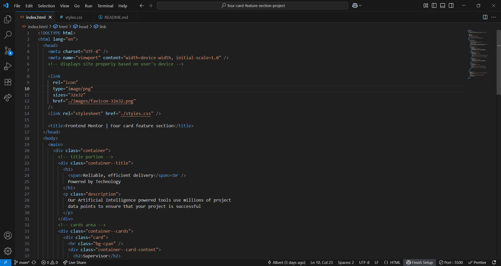
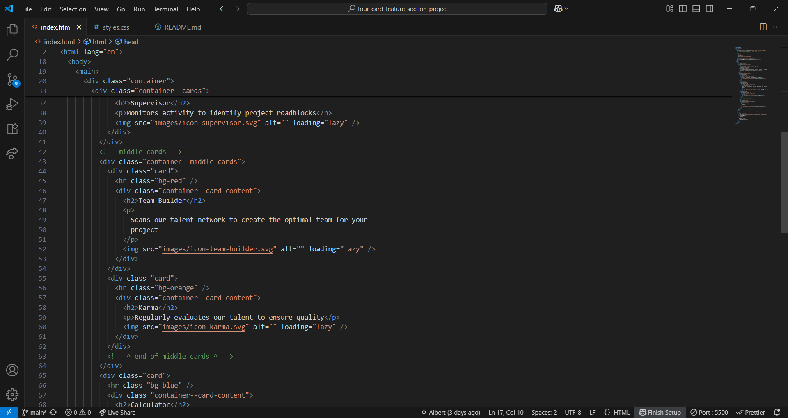
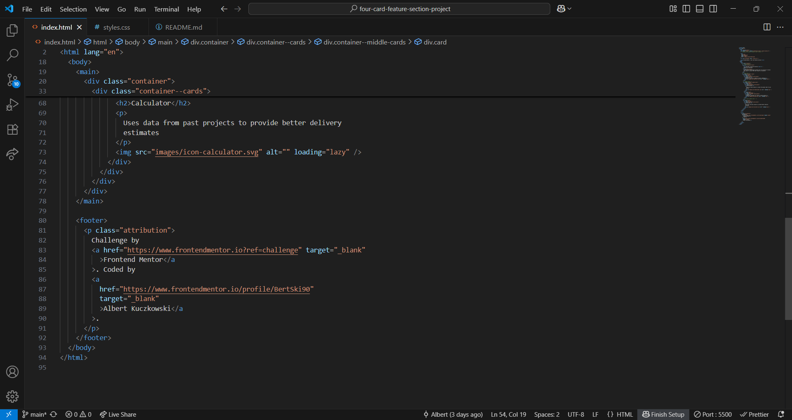
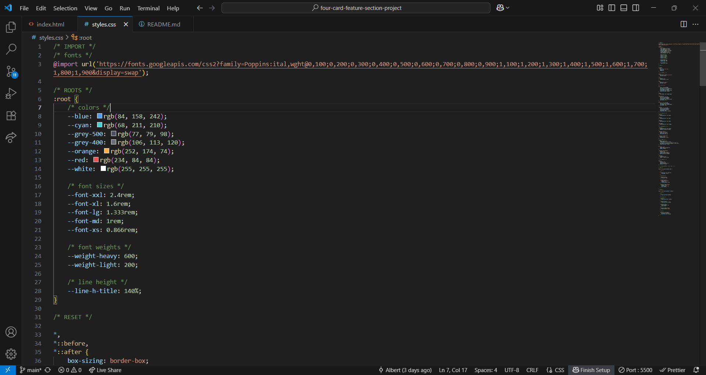
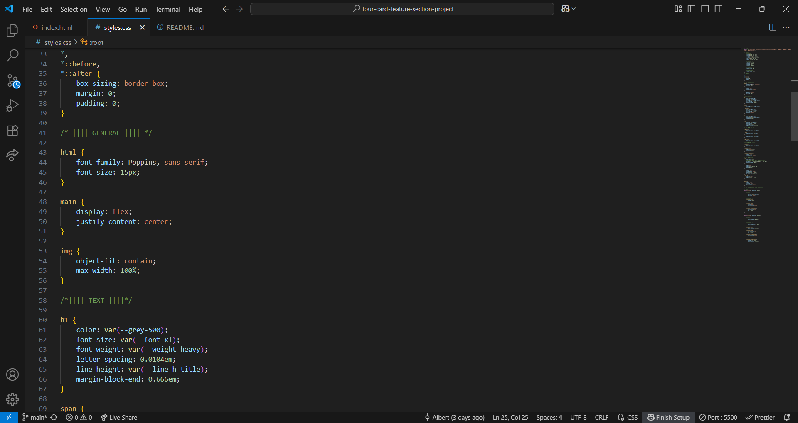
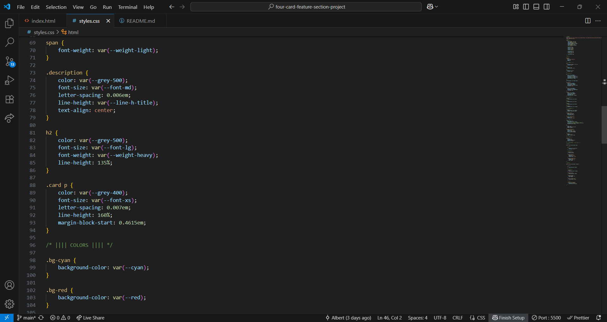
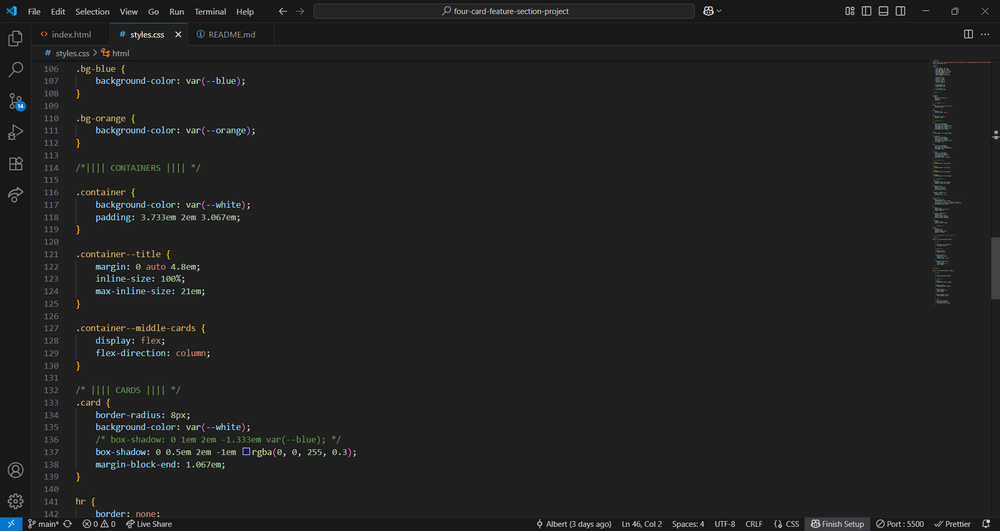
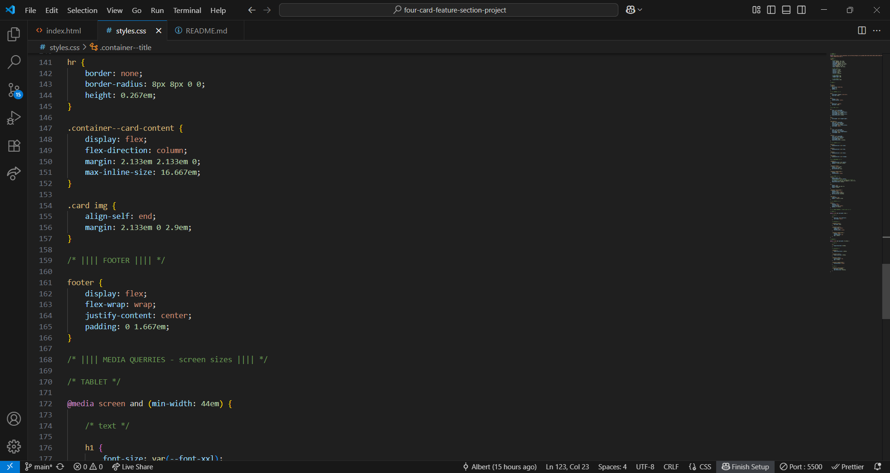
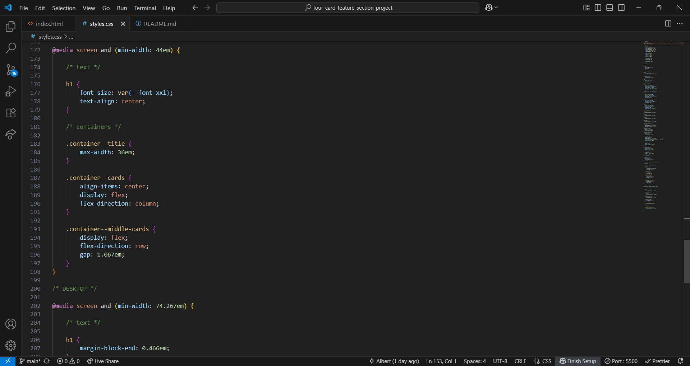
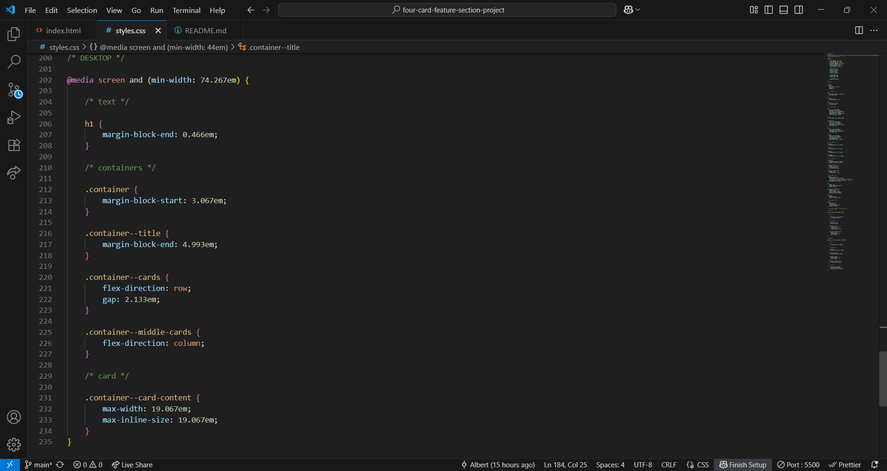

# Frontend Mentor - Four card feature section solution

This is a solution to the [Four card feature section challenge on Frontend Mentor](https://www.frontendmentor.io/challenges/four-card-feature-section-weK1eFYK). Frontend Mentor challenges help you improve your coding skills by building realistic projects.

## Table of contents

- [Overview](#overview)
  - [The challenge](#the-challenge)
  - [Screenshot](#screenshot)
  - [Links](#links)
- [My process](#my-process)
  - [Built with](#built-with)
  - [What I learned](#what-i-learned)
  - [Continued development](#continued-development)
  - [Useful resources](#useful-resources)
- [Author](#author)
- [Acknowledgments](#acknowledgments)

## Overview

### The challenge

Users should be able to:

- View the optimal layout for the site depending on their device's screen size

### Screenshot

HTML




CSS








### Links

- Solution URL: [Github](https://github.com/BertSki90/four-card-feature-section-project)
- Live Site URL: [Frontend Mentor](https://www.frontendmentor.io/profile/BertSki90)

## My process

### Built with

- Semantic HTML5 markup
- CSS custom properties
- Flexbox
- Mobile-first workflow

### What I learned

I had the oppertunity to practice with box-shadow. The box-shadow property accepts parameters of, in this order, horizontal, vertical, blur, spread, color, and inset. See below for code snippet:

```html
<div class="card">
  <hr class="bg-cyan" />
  <div class="container--card-content">
    <h2>Supervisor</h2>
    <p>Monitors activity to identify project roadblocks</p>
    
  </div>
</div>
```

```css
.card {
  border-radius: 8px;
  background-color: var(--white);
  /* box-shadow: 0 1em 2em -1.333em var(--blue); */
  box-shadow: 0 0.5em 2em -1em rgba(0, 0, 255, 0.3);
  margin-block-end: 1.067em;
}
```

### Continued development

Completion Time: 7hrs

I am getting more practice with rem and em units. I am trying to utilize the margin-line-start/end and margin-block-start-end and inline-size/max-inline-size properties. It is a lot of information that I enjoy putting to use. Thank you!

### Useful resources

- [W3Schools](https://www.w3schools.com/css/css3_shadows_box.asp) - Helped me with the box-shadow and its parameters.

## Author

- Website (Github profile) - [@BertSki90](https://github.com/BertSki90)
- Frontend Mentor - [@BertSki90](https://www.frontendmentor.io/profile/BertSki90)
- X - [@BertSki90](https://x.com/BertSki90)

## Acknowledgments

I would like to thank the entire Frontend Mentor and FreeCodeCamp websites. They have given me much knowledge and excitement for coding. I appreciate your time in providing me all these resources.
